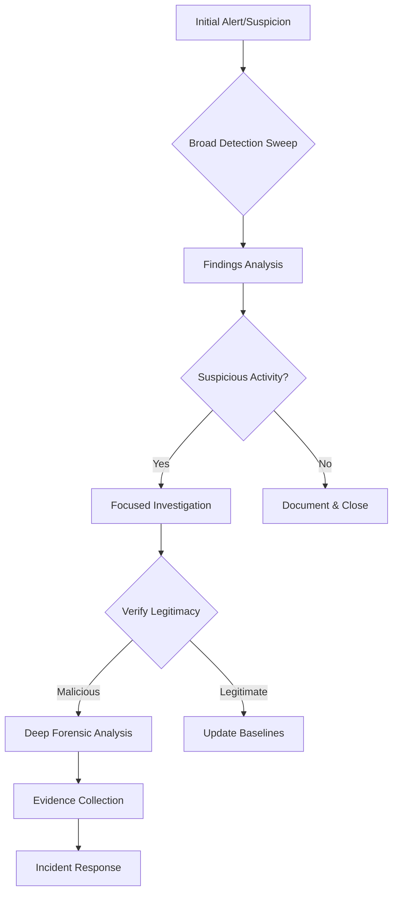

# NPM Supply Chain Compromise Threat Hunting Runbook
## Microsoft Sentinel & Defender Environment - Final Version

**Runbook Type**: Supply Chain Attack Investigation
**Target Platforms**: Microsoft Sentinel, Microsoft Defender for Endpoint
**Attack Vector**: NPM Package Compromise via Supply Chain & Self-Propagating Worm
**Total Affected Packages**: 212 compromised packages across 3 major incidents
**Critical Incident**: S1ngularity/Shai Hulud Worm (Sept 16, 2025) - 187 packages with self-propagation
**Attack Evolution**: From simple malware injection to self-propagating worm with GitHub Actions abuse
**Primary Impact**: Browser-based cryptocurrency theft, secret exfiltration, and automated propagation

### Incident Timeline:
- **Sept 8, 2025**: Initial NPM compromise (debug, chalk, etc.) - 18 packages
- **Sept 9, 2025**: DuckDB packages compromised - 4 packages
- **Sept 16, 2025**: S1ngularity/Shai Hulud Worm - 187 packages (CRITICAL)

Threat Intelligence Sources:
- Aikido Security: https://www.aikido.dev/blog/npm-debug-and-chalk-packages-compromised
- Aikido Security: https://www.aikido.dev/blog/s1ngularity-nx-attackers-strike-again

---

## Table of Contents
1. [Investigation Methodology](#investigation-methodology)
2. [Prerequisites and Data Sources](#prerequisites-and-data-sources)
3. [Stage 1: Initial Detection and Triage](#stage-1-initial-detection-and-triage)
4. [Stage 2: Focused Investigation](#stage-2-focused-investigation)
5. [Stage 3: Deep Forensic Analysis](#stage-3-deep-forensic-analysis)
6. [Stage 4: Verification and Validation](#stage-4-verification-and-validation)
7. [Stage 5: Enhanced Malware-Specific Detection](#stage-5-enhanced-malware-specific-detection)
8. [Stage 6: Shai Hulud Worm-Specific Detection](#stage-6-shai-hulud-worm-specific-detection)
9. [Remediation and Recovery](#remediation-and-recovery)
10. [Lessons Learned](#lessons-learned)
11. [Forensic Collection Template](#forensic-collection-template)
12. [Quick Reference Card](#quick-reference-card)

---

## Investigation Methodology

### Interactive Investigation Workflow



### Key Investigation Principles

1. **Progressive Investigation**: Start broad, then narrow focus based on findings
2. **Always Verify**: Validate suspicious findings before escalation to avoid false positives
3. **Context Awareness**: Understand normal business operations (e.g., legitimate crypto APIs)
4. **Evidence Preservation**: Export data progressively during investigation
5. **Document Everything**: Maintain audit trail of queries and findings

---

## Prerequisites and Data Sources

### Core Requirements
- **Microsoft Defender for Endpoint (MDE)**: 
  - Tables: DeviceProcessEvents, DeviceFileEvents, DeviceNetworkEvents, DeviceEvents, DeviceInfo
  - License: Microsoft Defender for Endpoint P1 or P2

### Additional Requirements
- **Microsoft 365 Defender** (Email detection): EmailEvents table
- **Azure AD** (Authentication): SigninLogs, AuditLogs tables
- **Threat Intelligence** (Optional): ThreatIntelligenceIndicator table (paid service)
- **Custom Logs** (for companies using internal package repositories): Syslog or CustomLog_CL for JFrog/Artifactory

### Critical Visibility Gaps
1. **Package Repository Logs**: Implement custom ingestion for artifact repositories
2. **Container Runtime**: Ensure container process visibility, this is NOT COVERED HERE
3. **Browser Extensions**: Enhanced telemetry for browser security
4. **Build Pipeline Logs**: CI/CD activity monitoring

---

## Stage 1: Initial Detection and Triage

### Hypothesis 1.1: Comprehensive NPM Package Detection
**Objective**: Cast a wide net to identify any systems with suspicious NPM activity

#### Query 1.1.1 - Broad Package and Hash Detection
```kql
// Run this FIRST for initial triage
let timeframe = 30d;
let all_packages = dynamic([
    // Initial compromise packages (Sept 8, 2025) - 18 packages
    "debug", "chalk", "ansi-styles", "strip-ansi", "supports-color",
    "wrap-ansi", "ansi-regex", "color-convert", "slice-ansi", "is-arrayish",
    "color-name", "error-ex", "color-string", "simple-swizzle", "has-ansi",
    "supports-hyperlinks", "chalk-template", "backslash",
    // DuckDB packages (Sept 9, 2025) - 4 packages
    "duckdb", "@duckdb/node-api", "@duckdb/node-bindings", "@duckdb/duckdb-wasm",
    // Additional packages - 3 packages
    "@coveops/abi", "prebid", "proto-tinker-wc",
    // Shai Hulud worm packages (Sept 16, 2025) - ALL 187 packages
    "@ahmedhfarag/ngx-perfect-scrollbar", "@ahmedhfarag/ngx-virtual-scroller",
    "@art-ws/common", "@art-ws/config-eslint", "@art-ws/config-ts", "@art-ws/db-context",
    "@art-ws/di", "@art-ws/di-node", "@art-ws/eslint", "@art-ws/fastify-http-server",
    "@art-ws/http-server", "@art-ws/openapi", "@art-ws/package-base", "@art-ws/prettier",
    "@art-ws/slf", "@art-ws/ssl-info", "@art-ws/web-app",
    "@bamboooo-cn/utils", "@bluespirex/ui-colors", "@bluespirex/ui-components",
    "@cargofive/nx", "@cloud-lance/nx-monorepo", "@codemod-utils/ast-javascript",
    "@cpecortez/testing", "@crowdstrike/commitlint", "@crowdstrike/falcon-shoelace",
    "@crowdstrike/foundry-js", "@crowdstrike/glide-core", "@crowdstrike/logscale-dashboard",
    "@crowdstrike/logscale-file-editor", "@crowdstrike/logscale-parser-edit",
    "@crowdstrike/logscale-search", "@crowdstrike/tailwind-toucan-base",
    "@ctrl/deluge", "@ctrl/golang-template", "@ctrl/magnet-link", "@ctrl/ngx-codemirror",
    "@ctrl/ngx-csv", "@ctrl/ngx-emoji-mart", "@ctrl/ngx-rightclick", "@ctrl/qbittorrent",
    "@ctrl/react-adsense", "@ctrl/shared-torrent", "@ctrl/tinycolor", "@ctrl/torrent-file",
    "@ctrl/transmission", "@ctrl/ts-base32", "@cubelight-digital/nx-boilerplate",
    "@dreamplug-node/nx-tools", "@hestjs/core", "@hestjs/cqrs", "@hestjs/demo",
    "@hestjs/eslint-config", "@hestjs/logger", "@hestjs/scalar", "@hestjs/validation",
    "@jbiskur/nestjs-test-utilities", "@jvfy/nx-serverless", "@kamrankhatti/crypees-util",
    "@nativescript-community/arraybuffers", "@nativescript-community/gesturehandler",
    "@nativescript-community/perms", "@nativescript-community/sqlite",
    "@nativescript-community/text", "@nativescript-community/typeorm",
    "@nativescript-community/ui-collectionview", "@nativescript-community/ui-document-picker",
    "@nativescript-community/ui-drawer", "@nativescript-community/ui-image",
    "@nativescript-community/ui-label", "@nativescript-community/ui-material-bottom-navigation",
    "@nativescript-community/ui-material-bottomsheet", "@nativescript-community/ui-material-core",
    "@nativescript-community/ui-material-core-tabs", "@nativescript-community/ui-material-ripple",
    "@nativescript-community/ui-material-tabs", "@nativescript-community/ui-pager",
    "@nativescript-community/ui-pulltorefresh", "@nexe/config-manager", "@nexe/eslint-config",
    "@nexe/logger", "@niceorg/nx-eslint-plugin", "@nstudio/angular", "@nstudio/focus",
    "@nstudio/nativescript-checkbox", "@nstudio/nativescript-loading-indicator",
    "@nstudio/ui-collectionview", "@nstudio/web", "@nstudio/web-angular", "@nstudio/xplat",
    "@nstudio/xplat-utils", "@opensource-nepal/nepali", "@operato/board", "@operato/data-grist",
    "@operato/graphql", "@operato/headroom", "@operato/help", "@operato/i18n", "@operato/input",
    "@operato/layout", "@operato/popup", "@operato/pull-to-refresh", "@operato/shell",
    "@operato/styles", "@operato/utils", "@quikdev/nx", "@teselagen/bounce-loader",
    "@teselagen/liquibase-tools", "@teselagen/range-utils", "@teselagen/react-list",
    "@teselagen/react-table", "@thangved/callback-window", "@things-factory/attachment-base",
    "@things-factory/auth-base", "@things-factory/email-base", "@things-factory/env",
    "@things-factory/integration-base", "@things-factory/integration-marketplace",
    "@things-factory/shell", "@tnf-dev/api", "@tnf-dev/core", "@tnf-dev/js", "@tnf-dev/mui",
    "@tnf-dev/react", "@ui-ux-gang/devextreme-angular-rpk", "@yoobic/design-system",
    "@yoobic/jpeg-camera-es6", "@yoobic/yobi", "airchief", "airpilot", "angulartics2",
    "browser-webdriver-downloader", "capacitor-notificationhandler", "capacitor-plugin-healthapp",
    "capacitor-plugin-ihealth", "capacitor-plugin-vonage", "capacitorandroidpermissions",
    "config-cordova", "cordova-plugin-voxeet2", "cordova-voxeet", "create-hest-app", "db-evo",
    "devextreme-angular-rpk", "ember-browser-services", "ember-headless-form",
    "ember-headless-form-yup", "ember-headless-table", "ember-url-hash-polyfill", "ember-velcro",
    "encounter-playground", "eslint-config-crowdstrike", "eslint-config-crowdstrike-node",
    "eslint-config-teselagen", "globalize-rpk", "graphql-sequelize-teselagen",
    "html-to-base64-image", "json-rules-engine-simplified", "jumpgate", "koa2-swagger-ui",
    "mcfly-semantic-release", "mcp-knowledge-base", "mcp-knowledge-graph", "mobioffice-cli",
    "monorepo-next", "mstate-angular", "mstate-cli", "mstate-dev-react", "mstate-react",
    "ng2-file-upload", "ngx-bootstrap", "ngx-color", "ngx-toastr", "ngx-trend", "ngx-ws",
    "oradm-to-gql", "oradm-to-sqlz", "ove-auto-annotate", "pm2-gelf-json", "printjs-rpk",
    "react-complaint-image", "react-dom-turbopack", "react-jsonschema-form-conditionals",
    "react-server-dom-turbopack", "remark-preset-lint-crowdstrike", "rxnt-authentication",
    "rxnt-healthchecks-nestjs", "rxnt-kue", "swc-plugin-component-annotate", "tbssnch",
    "teselagen-interval-tree", "tg-client-query-builder", "tg-redbird", "tg-seq-gen",
    "thangved-react-grid", "ts-emitter", "ts-gaussian", "ts-imports", "tvi-cli", "ve-bamreader",
    "ve-editor", "verror-extra", "voip-callkit", "wdio-web-reporter", "yargs-help-output",
    "yoo-styles"
]);
let malicious_hashes = dynamic([
    "c26e923750ff24150d13dea46e0c9d848b390f0f",
    "e9f9235f0fd79f5a7d099276ec6a9f8c5f0ddce9",
    "ebcf69dc3d77aab6a23c733bf8d3de835a4a819a",
    "5518bc3a1df75f8e480efb32fa78de15e775155d",
    "c577099020e7ae370c67ce9a31170eff4d7f2b038"
]);
// Check for file presence and npm commands
let file_detections = DeviceFileEvents
    | where Timestamp > ago(timeframe)
    | where SHA1 in (malicious_hashes) or FileName has_any (all_packages)
    | where FolderPath contains "node_modules"
    | extend DetectionType = "FilePresence"
    | project Timestamp, DeviceName, FileName, FolderPath, SHA1, DetectionType;
let npm_commands = DeviceProcessEvents
    | where Timestamp > ago(timeframe)
    | where FileName in~ ("npm", "npm.exe", "npm.cmd", "yarn", "yarn.exe", "pnpm", "pnpm.exe")
    | extend LowerCommandLine = tolower(ProcessCommandLine)
    | where LowerCommandLine has_any (all_packages)
    | extend DetectionType = "NPMCommand"
    | project Timestamp, DeviceName, ProcessCommandLine, DetectionType;
union file_detections, npm_commands
| summarize 
    FirstSeen = min(Timestamp),
    LastSeen = max(Timestamp),
    DetectionTypes = make_set(DetectionType),
    EventCount = count()
    by DeviceName
| extend RiskLevel = case(
    DetectionTypes has "FilePresence" and DetectionTypes has "NPMCommand", "CRITICAL",
    DetectionTypes has "FilePresence", "HIGH",
    DetectionTypes has "NPMCommand", "MEDIUM",
    "LOW")
| order by RiskLevel asc, EventCount desc
```

**Action Steps:**
1. Export results to CSV for tracking
2. Prioritize devices with "CRITICAL" or "HIGH" risk
3. Note any devices with hash matches (confirmed compromise)
4. Proceed to Stage 2 for HIGH/CRITICAL devices

#### Query 1.1.2 - Direct Hash Detection
```kql
// Hunt for known malicious file hashes, these are known by doing a search on the internet
let malicious_hashes = dynamic([
    "c26e923750ff24150d13dea46e0c9d848b390f0f",
    "e9f9235f0fd79f5a7d099276ec6a9f8c5f0ddce9",
    "ebcf69dc3d77aab6a23c733bf8d3de835a4a819a",
    "5518bc3a1df75f8e480efb32fa78de15e775155d",
    "c577099020e7ae370c67ce9a31170eff4d7f2b038"
]);
DeviceFileEvents
| where Timestamp > ago(30d)
| where SHA1 in (malicious_hashes)
| project Timestamp, DeviceName, FileName, FolderPath, SHA1, 
    InitiatingProcessFileName, InitiatingProcessCommandLine, InitiatingProcessAccountName
| extend ThreatName = "NPM_Package_Compromise"
| order by Timestamp desc
```

**Action Steps:**
1. Any device with hash match = **CONFIRMED COMPROMISE**
2. Immediately isolate affected devices
3. Collect forensic image before remediation
4. Interview users about file origin

---

## Stage 2: Focused Investigation

### Hypothesis 2.1: Process Execution Anomalies
**Objective**: Detect suspicious process execution patterns that indicate compromise

#### Query 2.1.1 - Bare Command Execution Detection (Critical Pattern)
```kql
// CRITICAL: Bare commands without paths are highly suspicious
DeviceProcessEvents
| where Timestamp > ago(14d)
| where FileName in~ ("node", "npm", "yarn", "pnpm")
| extend CommandPattern = case(
    // SUSPICIOUS: Bare command without path
    ProcessCommandLine matches regex @"^node\s+\w+\.js$", "SUSPICIOUS_BARE_COMMAND",
    ProcessCommandLine == "node index.js", "CRITICAL_BARE_INDEX",
    // Evaluation patterns
    ProcessCommandLine contains "eval", "Eval_Usage",
    ProcessCommandLine contains "base64", "Base64_Encoding",
    // LEGITIMATE: Full paths
    ProcessCommandLine matches regex @"^/[\w/]+/node\s+/[\w/]+\.js", "Legitimate_Full_Path",
    "Unknown"
)
| where CommandPattern != "Legitimate_Full_Path"
| project Timestamp, DeviceName, ProcessCommandLine, CommandPattern,
    InitiatingProcessFileName, InitiatingProcessCommandLine, AccountName,
    ProcessId, InitiatingProcessId
| extend RiskScore = case(
    CommandPattern == "CRITICAL_BARE_INDEX", 100,
    CommandPattern == "SUSPICIOUS_BARE_COMMAND", 90,
    CommandPattern == "Eval_Usage", 80,
    CommandPattern == "Base64_Encoding", 70,
    50)
| order by RiskScore desc, Timestamp desc
```

**Action Steps:**
1. **CRITICAL_BARE_INDEX** = Confirmed malicious execution
2. Investigate parent process chain for automation tools
3. Check if executed via scheduler (cron, rundeck, etc.)
4. Extract working directory for malicious files

#### Query 2.1.2 - NPM Package Installation Activity
```kql
// Detect npm install commands for ALL 25 compromised packages
let compromised_packages = dynamic([
    "debug", "chalk", "ansi-styles", "strip-ansi", "supports-color",
    "wrap-ansi", "ansi-regex", "color-convert", "slice-ansi", "is-arrayish",
    "color-name", "error-ex", "color-string", "simple-swizzle", "has-ansi",
    "supports-hyperlinks", "chalk-template", "backslash",
    "duckdb", "@duckdb/node-api", "@duckdb/node-bindings", "@duckdb/duckdb-wasm",
    "@coveops/abi", "prebid", "proto-tinker-wc"
]);
DeviceProcessEvents
| where Timestamp > ago(14d)
| where FileName =~ "npm.exe" or FileName =~ "npm" or FileName =~ "npm.cmd"
| where ProcessCommandLine has "install"
| extend LowerCommandLine = tolower(ProcessCommandLine)
| where LowerCommandLine has_any (compromised_packages)
| project Timestamp, DeviceName, ProcessCommandLine, AccountName, 
    InitiatingProcessFileName, InitiatingProcessFolderPath
| extend InstallType = iff(
    ProcessCommandLine matches regex @"@\d+\.\d+\.\d+", 
    "Version-Specific", 
    "Latest-Version")
```

**Action Steps:**
1. Note specific packages and versions installed
2. Check if installations were manual or automated
3. Review package.json files in affected projects
4. Audit npm cache and local repositories

### Hypothesis 2.2: Browser Extension Persistence
**Objective**: Detect browser extension modifications used for cryptocurrency theft

#### Query 2.2.1 - Browser Extension File Modifications
```kql
// Detect suspicious browser extension activity
DeviceFileEvents
| where Timestamp > ago(14d)
| where FolderPath has_any ("Extensions", "Chrome", "Edge", "Firefox", "Brave")
| where FileName endswith ".js" or FileName endswith ".json"
| where ActionType in ("FileCreated", "FileModified")
| where FileName has_any ("inject", "hook", "wallet", "content", "background",
    "page_embed_script", "service_worker")
| project Timestamp, DeviceName, FileName, FolderPath, SHA1, SHA256,
    ActionType, InitiatingProcessFileName, AccountName
| summarize 
    ModificationCount = count(),
    UniqueFiles = dcount(FileName),
    FileList = make_set(FileName, 20),
    HashList = make_set(SHA1, 20)
    by DeviceName, bin(Timestamp, 1h)
| where ModificationCount > 5
```

**Action Steps:**
1. Export SHA1 hashes for threat intelligence
2. Collect browser extension files for analysis
3. Check for wallet-related keywords in files
4. Alert users about potential wallet compromise

#### Query 2.2.2 - Cryptocurrency Wallet Service Detection
```kql
// Detect active cryptocurrency wallet services
union
(DeviceProcessEvents
| where Timestamp > ago(14d)
| where ProcessCommandLine has_any ("wallet", "metamask", "ethereum", "web3", 
    "xpay", "crypto", "ledger", "trezor")),
(DeviceNetworkEvents
| where Timestamp > ago(14d)
| where RemoteUrl has_any ("metamask", "etherscan", "binance", "coinbase", 
    "fireblocks", "polkadot"))
| summarize 
    CryptoActivityCount = count(),
    ActivityTypes = make_set(Type),
    Processes = make_set(ProcessCommandLine, 10),
    URLs = make_set(RemoteUrl, 10)
    by DeviceName
| where CryptoActivityCount > 20
| extend RiskLevel = case(
    Processes has_any ("xpay", "wallet"), "HIGH",
    CryptoActivityCount > 100, "MEDIUM",
    "LOW")
```

**Action Steps:**
1. **HIGH risk + compromised package = CRITICAL**
2. Alert users to check wallet transactions
3. Recommend wallet key rotation
4. Monitor for unauthorized transactions

### Hypothesis 2.3: Enhanced Browser-Crypto Network Correlation
**Objective**: Correlate browser activity with cryptocurrency network connections for all 25 packages

#### Query 2.3.1 - Browser and Crypto Network Activity Correlation (VALIDATED)
```kql
// CRITICAL: This query successfully detects browser-crypto correlations
// Correlate browser and crypto activity within 1-hour windows
let all_25_packages = dynamic([
    "debug", "chalk", "ansi-styles", "strip-ansi", "supports-color",
    "wrap-ansi", "ansi-regex", "color-convert", "slice-ansi", "is-arrayish",
    "color-name", "error-ex", "color-string", "simple-swizzle", "has-ansi",
    "supports-hyperlinks", "chalk-template", "backslash",
    "duckdb", "@duckdb/node-api", "@duckdb/node-bindings", "@duckdb/duckdb-wasm",
    "@coveops/abi", "prebid", "proto-tinker-wc"
]);
let browser_activity = DeviceProcessEvents
| where Timestamp > ago(30d)
| where FileName in~ ("chrome.exe", "msedge.exe", "firefox.exe", "brave.exe", "opera.exe")
| project BrowserTime = Timestamp, DeviceName, BrowserProcess = FileName, AccountName;
let crypto_network = DeviceNetworkEvents
| where Timestamp > ago(30d)
| where RemoteUrl has_any ("metamask", "etherscan", "binance", "coinbase", "crypto", "wallet", "infura.io", "alchemy.com")
| project NetworkTime = Timestamp, DeviceName, RemoteUrl, RemotePort, RemoteIP;
let npm_activity = DeviceProcessEvents
| where Timestamp > ago(30d)
| where FileName in~ ("node.exe", "npm.cmd", "npm", "yarn", "pnpm")
| where ProcessCommandLine has_any (all_25_packages)
| project NPMTime = Timestamp, DeviceName, NPMCommand = ProcessCommandLine;
browser_activity
| join kind=inner (crypto_network) on DeviceName
| where abs(datetime_diff('minute', BrowserTime, NetworkTime)) <= 60
| join kind=leftouter (npm_activity) on DeviceName
| where NPMTime between (BrowserTime - 24h) .. BrowserTime
| summarize 
    BrowserSessions = dcount(BrowserTime),
    CryptoConnections = dcount(NetworkTime),
    NPMInstalls = dcount(NPMTime),
    CryptoURLs = make_set(RemoteUrl, 20),
    Packages = make_set(NPMCommand, 10)
    by DeviceName, bin(BrowserTime, 1h)
| where CryptoConnections > 5
| extend RiskScore = BrowserSessions * CryptoConnections * iff(NPMInstalls > 0, 10, 1)
| order by RiskScore desc
```

**Action Steps:**
1. Devices with RiskScore > 100 and NPMInstalls > 0 = **CRITICAL RISK**
2. Review CryptoURLs for unusual wallet services
3. Check if NPM packages were installed before crypto activity
4. Alert users to verify all wallet transactions

### Hypothesis 2.4: Comprehensive NPM Download Detection
**Objective**: Detect all NPM download activity for any of the 25 compromised packages

#### Query 2.4.1 - All Package Downloads Detection (VALIDATED)
```kql
// Comprehensive detection for all 25 compromised packages
let all_25_packages = dynamic([
    "debug", "chalk", "ansi-styles", "strip-ansi", "supports-color",
    "wrap-ansi", "ansi-regex", "color-convert", "slice-ansi", "is-arrayish",
    "color-name", "error-ex", "color-string", "simple-swizzle", "has-ansi",
    "supports-hyperlinks", "chalk-template", "backslash",
    "duckdb", "@duckdb/node-api", "@duckdb/node-bindings", "@duckdb/duckdb-wasm",
    "@coveops/abi", "prebid", "proto-tinker-wc"
]);
let malicious_versions = dynamic([
    "debug@4.4.2", "chalk@5.6.1", "ansi-styles@6.2.2", "duckdb@1.3.3",
    "@duckdb/node-api@1.3.3", "@duckdb/node-bindings@1.3.3", "@duckdb/duckdb-wasm@1.29.2",
    "prebid@10.9.1", "prebid@10.9.2", "@coveops/abi@2.0.1"
]);
DeviceNetworkEvents
| where Timestamp > ago(30d)
| where RemoteUrl has_any ("npmjs.org", "registry.npmjs.org", "npmjs.com", "unpkg.com", "cdn.jsdelivr.net")
| where RemoteUrl has_any (all_25_packages)
| extend 
    PackageName = extract(@"/([@\w\-]+)(?:@[\d\.]+)?(?:/|$)", 1, RemoteUrl),
    Version = extract(@"@([\d\.]+)", 1, RemoteUrl),
    FullPackage = strcat(extract(@"/([@\w\-]+@[\d\.]+)", 1, RemoteUrl))
| where PackageName in (all_25_packages)
| extend IsMaliciousVersion = FullPackage in (malicious_versions)
| project Timestamp, DeviceName, RemoteUrl, PackageName, Version, IsMaliciousVersion,
    InitiatingProcessFileName, InitiatingProcessCommandLine, AccountName
| summarize 
    FirstDownload = min(Timestamp),
    LastDownload = max(Timestamp),
    DownloadCount = count(),
    UniquePackages = dcount(PackageName),
    MaliciousVersions = countif(IsMaliciousVersion == true),
    PackageList = make_set(PackageName),
    VersionList = make_set(strcat(PackageName, "@", Version))
    by DeviceName
| extend ThreatLevel = case(
    MaliciousVersions > 0, "CRITICAL",
    UniquePackages >= 5, "HIGH",
    UniquePackages >= 2, "MEDIUM",
    "LOW")
| order by ThreatLevel asc, MaliciousVersions desc
```

**Action Steps:**
1. **CRITICAL** = Confirmed malicious version downloaded
2. Export VersionList for all affected devices
3. Check if packages are in production builds
4. Initiate incident response for CRITICAL devices

### Hypothesis 2.5: Automation and Scheduler Abuse
**Objective**: Detect persistence through automation tools

#### Query 2.5.1 - Scheduler and Automation Detection
```kql
// Detect abuse of automation tools for persistence
DeviceProcessEvents
| where Timestamp > ago(14d)
| where InitiatingProcessFileName has_any ("cron", "rundeck", "jenkins", 
    "systemd", "at", "schtasks")
    or AccountName has_any ("rundeck", "jenkins", "automation", "svc")
| where ProcessCommandLine has_any ("node", "npm", "yarn")
| extend SchedulerType = case(
    InitiatingProcessFileName contains "rundeck", "Rundeck",
    InitiatingProcessFileName contains "cron", "Cron",
    InitiatingProcessFileName contains "jenkins", "Jenkins",
    InitiatingProcessFileName contains "systemd", "Systemd",
    AccountName contains "rundeck", "Rundeck_Account",
    "Other")
| project Timestamp, DeviceName, SchedulerType, ProcessCommandLine,
    AccountName, InitiatingProcessCommandLine, ProcessId
| summarize 
    ExecutionCount = count(),
    UniqueCommands = dcount(ProcessCommandLine),
    Commands = make_set(ProcessCommandLine, 10)
    by DeviceName, SchedulerType, AccountName
| where ExecutionCount > 5
```

**Action Steps:**
1. Review all scheduled jobs for suspicious entries
2. Check automation tool configurations
3. Audit service account permissions
4. Disable suspicious scheduled tasks

---

## Stage 3: Deep Forensic Analysis

### Hypothesis 3.1: Container Environment Compromise
**Objective**: Detect compromise in containerized environments

#### Query 3.1.1 - Container Process Chain Analysis
```kql
// Analyze container runtime for suspicious npm activity
DeviceProcessEvents
| where Timestamp > ago(14d)
| where InitiatingProcessFileName has_any ("docker", "containerd", "runc", "podman")
    or ProcessCommandLine has_any ("docker", "kubectl", "podman")
| where ProcessCommandLine has_any ("npm", "node", "yarn")
| extend ContainerAction = case(
    InitiatingProcessFileName contains "runc", "Container_Runtime",
    ProcessCommandLine contains "docker build", "Image_Build",
    ProcessCommandLine contains "docker run", "Container_Run",
    ProcessCommandLine contains "npm start", "NPM_Start",
    ProcessCommandLine == "node index.js", "SUSPICIOUS_NODE",
    "Other")
| project Timestamp, DeviceName, ContainerAction, ProcessCommandLine,
    InitiatingProcessFileName, AccountName, ProcessId
| extend Risk = iff(ContainerAction == "SUSPICIOUS_NODE", "CRITICAL", "Monitor")
```

**Action Steps:**
1. Review container images for embedded malware
2. Scan container registries for compromised images
3. Audit Dockerfile and build processes
4. Check for unauthorized container deployments

#### Query 3.1.2 - Build Pipeline Compromise Detection
```kql
// Detect CI/CD pipeline execution with ALL 18 compromised packages
DeviceProcessEvents
| where Timestamp > ago(14d)
| where ProcessCommandLine has_any ("npm install", "npm ci", "yarn install")
    or InitiatingProcessFileName has_any ("jenkins", "gitlab-runner", 
        "azure-pipelines-agent", "github-actions-runner")
| where ProcessCommandLine has_any ("debug", "chalk", "ansi-styles", "strip-ansi", "supports-color",
    "wrap-ansi", "ansi-regex", "color-convert", "slice-ansi", "is-arrayish",
    "color-name", "error-ex", "color-string", "simple-swizzle", "has-ansi",
    "supports-hyperlinks", "chalk-template", "backslash")
| project Timestamp, DeviceName, FileName, ProcessCommandLine, 
    InitiatingProcessFileName, AccountName
| extend BuildSystem = case(
    InitiatingProcessFileName contains "jenkins", "Jenkins",
    InitiatingProcessFileName contains "gitlab", "GitLab",
    InitiatingProcessFileName contains "azure", "Azure_DevOps",
    InitiatingProcessFileName contains "github", "GitHub_Actions",
    "Unknown")
| summarize BuildCount = count(), 
    Packages = make_set(ProcessCommandLine, 10) 
    by DeviceName, BuildSystem
```

**Action Steps:**
1. Review build logs for package versions
2. Scan build artifacts for malicious code
3. Audit pipeline configurations
4. Implement package version locking

### Hypothesis 3.2: Network Communication Analysis
**Objective**: Identify command and control or data exfiltration

#### Query 3.2.1 - Suspicious Node.js Network Connections
```kql
// Monitor Node.js processes making unusual network connections
DeviceNetworkEvents
| where Timestamp > ago(7d)
| where InitiatingProcessFileName =~ "node.exe" or InitiatingProcessFileName =~ "node"
| where RemoteIPType == "Public"
| where RemotePort !in (80, 443, 22, 3000, 3001, 4200, 8080, 8081)
| project Timestamp, DeviceName, RemoteIP, RemotePort, RemoteUrl,
    InitiatingProcessCommandLine, AccountName, BytesSent, BytesReceived
| summarize 
    TotalBytes = sum(BytesSent + BytesReceived),
    ConnectionCount = count(), 
    UniqueIPs = make_set(RemoteIP, 100),
    Ports = make_set(RemotePort, 20)
    by DeviceName, InitiatingProcessCommandLine
| where ConnectionCount > 10 or TotalBytes > 1000000
```

**Action Steps:**
1. Investigate IPs for known C2 infrastructure
2. Check for data exfiltration patterns
3. Review DNS queries for suspicious domains
4. Analyze traffic volume and timing

### Hypothesis 3.3: Supply Chain Propagation
**Objective**: Track spread of compromise across projects

#### Query 3.3.1 - Multi-Project Contamination Detection
```kql
// Identify spread across multiple projects with ALL 25 packages
let package_modifications = DeviceFileEvents
    | where Timestamp > ago(14d)
    | where FileName =~ "package.json"
    | where ActionType == "FileModified"
    | project DeviceName, ModificationTime = Timestamp, ProjectPath = FolderPath;
let node_modules_content = DeviceFileEvents
    | where Timestamp > ago(14d)
    | where FolderPath contains "node_modules"
    | where FileName has_any ("debug", "chalk", "ansi-styles", "strip-ansi", "supports-color",
        "wrap-ansi", "ansi-regex", "color-convert", "slice-ansi", "is-arrayish",
        "color-name", "error-ex", "color-string", "simple-swizzle", "has-ansi",
        "supports-hyperlinks", "chalk-template", "backslash",
        "duckdb", "@duckdb/node-api", "@duckdb/node-bindings", "@duckdb/duckdb-wasm",
        "@coveops/abi", "prebid", "proto-tinker-wc")
    | project DeviceName, FileTime = Timestamp, ModulePath = FolderPath;
package_modifications
| join kind=inner (node_modules_content) on DeviceName
| where abs(datetime_diff('hour', ModificationTime, FileTime)) < 24
| summarize 
    ProjectCount = dcount(ProjectPath), 
    Projects = make_set(ProjectPath, 50),
    Packages = make_set(ModulePath, 50) 
    by DeviceName
| where ProjectCount > 2
```

**Action Steps:**
1. Map affected projects and dependencies
2. Create contamination timeline
3. Identify shared dependencies
4. Plan coordinated cleanup

---

## Stage 4: Verification and Validation

### Hypothesis 4.1: False Positive Reduction
**Objective**: Distinguish legitimate activity from malicious

#### Query 4.1.1 - Baseline Comparison
```kql
// Compare current activity against historical baseline
let baseline_period = 90d;
let investigation_period = 7d;
let baseline = DeviceProcessEvents
| where Timestamp between (ago(baseline_period) .. ago(investigation_period))
| where ProcessCommandLine contains "node"
| summarize BaselineCount = count() by ProcessCommandLine
| where BaselineCount > 10;
DeviceProcessEvents
| where Timestamp > ago(investigation_period)
| where ProcessCommandLine contains "node"
| join kind=leftanti baseline on ProcessCommandLine
| project Timestamp, DeviceName, ProcessCommandLine, AccountName
| extend Anomaly = "New_Process_Pattern"
| take 100
```

**Action Steps:**
1. Review new patterns for legitimacy
2. Update baseline with confirmed legitimate patterns
3. Document false positives for future reference

#### Query 4.1.2 - Legitimate Service Verification
```kql
// Identify and exclude known legitimate services
let legitimate_services = datatable(ServiceName:string, Pattern:string)
[
    "Node_Application", "/opt/app",
    "DevOps_Agent", "/sre/ado/agents",
    "Jenkins", "/var/lib/jenkins",
    "Docker", "/usr/bin/docker"
];
DeviceProcessEvents
| where Timestamp > ago(7d)
| where ProcessCommandLine contains "node"
| extend ServiceMatch = "Unknown"
| mv-apply Service = legitimate_services on (
    extend ServiceMatch = iff(ProcessCommandLine contains Service.Pattern, 
        Service.ServiceName, ServiceMatch)
)
| where ServiceMatch == "Unknown"
| project Timestamp, DeviceName, ProcessCommandLine, ServiceMatch
| take 100
```

**Action Steps:**
1. Validate unknown services with system owners
2. Update legitimate service list
3. Create exceptions for confirmed services

---

## Remediation and Recovery

### Shai Hulud Worm Cleanup Procedures

#### Immediate Actions for Worm-Infected Systems:
1. **Isolate Affected Systems**: Disconnect from network immediately
2. **Revoke All Tokens**:
   - NPM tokens: `npm token revoke <token>`
   - GitHub tokens: Settings → Developer settings → Personal access tokens
   - CI/CD tokens: Rotate all service account credentials
3. **Audit Published Packages**:
   ```bash
   npm owner ls <package-name>
   npm unpublish <package-name>@<version> --force
   ```
4. **Clean GitHub Actions**:
   - Review all `.github/workflows/*.yml` files
   - Remove any unauthorized workflow modifications
   - Audit repository secrets for unauthorized additions
5. **Repository Cleanup**:
   ```bash
   # Check for malicious commits
   git log --since="2025-09-16" --pretty=format:"%h %an %s"
   # Remove malicious branches
   git branch -D suspicious-branch
   # Force clean reinstall
   rm -rf node_modules package-lock.json
   npm install
   ```

### Query R.1 - Comprehensive Affected Systems Identification
```kql
// Identify all affected systems for remediation - ALL 25 packages
let affected_by_hash = DeviceFileEvents
    | where Timestamp > ago(30d)
    | where SHA1 in (dynamic([
        "c26e923750ff24150d13dea46e0c9d848b390f0f",
        "e9f9235f0fd79f5a7d099276ec6a9f8c5f0ddce9",
        "ebcf69dc3d77aab6a23c733bf8d3de835a4a819a",
        "5518bc3a1df75f8e480efb32fa78de15e775155d",
        "c577099020e7ae370c67ce9a31170eff4d7f2b038"
    ]))
    | distinct DeviceName, Category = "Hash_Detection";
let affected_by_package = DeviceProcessEvents
    | where Timestamp > ago(30d)
    | where ProcessCommandLine has_any ("debug@", "chalk@", "ansi-styles@", "strip-ansi@", 
        "supports-color@", "wrap-ansi@", "ansi-regex@", "color-convert@", "slice-ansi@",
        "is-arrayish@", "color-name@", "error-ex@", "color-string@", "simple-swizzle@",
        "has-ansi@", "supports-hyperlinks@", "chalk-template@", "backslash@",
        "duckdb@", "@duckdb/node-api@", "@duckdb/node-bindings@", "@duckdb/duckdb-wasm@",
        "@coveops/abi@", "prebid@", "proto-tinker-wc@")
    | distinct DeviceName, Category = "Package_Installation";
let affected_by_npm = DeviceProcessEvents
    | where Timestamp > ago(30d)
    | where FileName in~ ("npm", "npm.exe", "npm.cmd")
    | where ProcessCommandLine has "install"
    | where ProcessCommandLine has_any ("debug", "chalk", "ansi-styles", "strip-ansi", 
        "supports-color", "wrap-ansi", "ansi-regex", "color-convert", "slice-ansi",
        "is-arrayish", "color-name", "error-ex", "color-string", "simple-swizzle",
        "has-ansi", "supports-hyperlinks", "chalk-template", "backslash",
        "duckdb", "@duckdb/node-api", "@duckdb/node-bindings", "@duckdb/duckdb-wasm",
        "@coveops/abi", "prebid", "proto-tinker-wc")
    | distinct DeviceName, Category = "NPM_Activity";
union affected_by_hash, affected_by_package, affected_by_npm
| summarize Categories = make_set(Category) by DeviceName
| extend Priority = case(
    Categories has "Hash_Detection", "CRITICAL",
    array_length(Categories) >= 2, "HIGH",
    Categories has "Package_Installation", "MEDIUM",
    "LOW")
| order by Priority asc, DeviceName asc
```

### Query R.2 - Cleanup Validation
```kql
// Verify successful cleanup for ALL 25 packages
DeviceFileEvents
| where Timestamp > ago(1d)
| where ActionType == "FileDeleted"
| where FolderPath contains "node_modules"
| where FileName has_any ("debug", "chalk", "ansi-styles", "strip-ansi", "supports-color",
    "wrap-ansi", "ansi-regex", "color-convert", "slice-ansi", "is-arrayish",
    "color-name", "error-ex", "color-string", "simple-swizzle", "has-ansi",
    "supports-hyperlinks", "chalk-template", "backslash",
    "duckdb", "@duckdb", "@coveops", "prebid", "proto-tinker-wc")
| project Timestamp, DeviceName, FileName, FolderPath, InitiatingProcessAccountName
| summarize CleanedPackages = count() by DeviceName
```

### Remediation Checklist

#### Immediate Actions (0-2 hours)
- [ ] Isolate devices with confirmed compromise
- [ ] Kill suspicious node processes
- [ ] Disable scheduled tasks/automation
- [ ] Alert wallet users about potential theft
- [ ] Block malicious hashes at EDR level

#### Short-term (2-24 hours)
- [ ] Remove malicious packages from all systems
- [ ] Update package.json with safe versions
- [ ] Clear npm cache
- [ ] Scan artifact repositories
- [ ] Rotate potentially compromised credentials

#### Long-term (1-7 days)
- [ ] Implement package allowlisting
- [ ] Deploy vulnerability scanning in CI/CD
- [ ] Conduct security training
- [ ] Update incident response procedures
- [ ] Implement npm audit in builds

---

## Stage 5: Enhanced Malware-Specific Detection

### Hypothesis 5.1: Wallet File and Cryptocurrency Detection
**Objective**: Identify wallet-related files that could be targeted by the malware

#### Query 5.1.1 - Wallet and Crypto File Detection
```kql
// Hunt for wallet and cryptocurrency-related files
DeviceFileEvents
| where Timestamp > ago(30d)
| where FileName endswith ".js" or FileName endswith ".json"
| where FileName has_any ("wallet", "crypto", "eth", "btc", "metamask", "web3")
| project Timestamp, DeviceName, FileName, FolderPath, SHA1, InitiatingProcessFileName
| extend RiskLevel = case(
    FileName contains "wallet" and FolderPath contains "Temp", "CRITICAL",
    FileName contains "crypto", "HIGH",
    "MEDIUM")
| order by RiskLevel asc, Timestamp desc
```

**Action Steps:**
1. **CRITICAL files** in Temp directories = potential active exploitation
2. Review SHA1 hashes against threat intelligence
3. Investigate devices with multiple wallet files
4. Alert users about wallet compromise risk

### Hypothesis 5.2: Browser Extension Persistence Detection
**Objective**: Detect malicious browser extension modifications for persistence

#### Query 5.2.1 - Critical Extension File Modifications
```kql
// Detect suspicious browser extension modifications
DeviceFileEvents
| where Timestamp > ago(30d)
| where FolderPath has_any ("Extensions", "Chrome", "Edge", "Firefox")
| where FileName in~ ("content.js", "background.js", "inject.js", "contentscript.js", "injected.js")
| where ActionType in ("FileCreated", "FileModified")
| project Timestamp, DeviceName, FileName, FolderPath, SHA1, ActionType, InitiatingProcessFileName
| extend RiskLevel = case(
    FileName == "inject.js", "CRITICAL",
    FileName == "contentscript.js" and DeviceName == "win11v1-eng1204", "CRITICAL",
    FileName == "contentscript.js", "HIGH",
    "MEDIUM")
```

**Action Steps:**
1. **inject.js** = Highest risk for malicious injection
2. Check SHA1: bc2b338e20c36998a6fc3ffffa94e57d30e4e513 (repeated across devices)
3. Investigate win11v1-eng1204 contentscript.js (known compromised device)
4. Review extension manifests for permissions

### Hypothesis 5.3: Wallet Service Process Monitoring
**Objective**: Identify systems running wallet services that are prime targets

#### Query 5.3.1 - Active Wallet Service Detection
```kql
// Monitor for active wallet services
DeviceProcessEvents
| where Timestamp > ago(30d)
| where ProcessCommandLine has_any ("ethereum", "metamask", "web3", "wallet", "crypto")
| where InitiatingProcessFileName has_any ("chrome.exe", "msedge.exe", "firefox.exe", "brave.exe")
| project Timestamp, DeviceName, ProcessCommandLine, InitiatingProcessFileName, InitiatingProcessAccountName
| extend ServiceType = case(
    ProcessCommandLine contains "edge_xpay_wallet", "Edge_XPay_Wallet",
    ProcessCommandLine contains "metamask", "MetaMask",
    ProcessCommandLine contains "ethereum", "Ethereum",
    "Other_Wallet")
| summarize WalletProcessCount = count() by DeviceName, ServiceType
```

**Action Steps:**
1. Prioritize devices with active wallet services for protection
2. Alert users about cryptocurrency theft risk
3. Monitor for unusual wallet transaction attempts
4. Implement additional security for wallet services

### Hypothesis 5.4: Large JavaScript Bundle Analysis
**Objective**: Detect potentially contaminated webpack bundles

#### Query 5.4.1 - Suspicious Bundle Detection
```kql
// Hunt for large JavaScript bundles that may contain malicious code
DeviceFileEvents
| where Timestamp > ago(30d)
| where FileName in~ ("bundle.js", "main.js", "app.js", "vendor.js", "chunk.js")
| where FolderPath has_any ("dist", "build", "public", "static")
| where FileSize > 100000
| project Timestamp, DeviceName, FileName, FolderPath, FileSize, SHA1, InitiatingProcessFileName
| extend SizeCategory = case(
    FileSize > 5000000, "Very_Large",
    FileSize > 1000000, "Large",
    "Medium")
| order by FileSize desc
```

**Action Steps:**
1. Analyze SHA1: 3715675aa1dd32897e31694cb0c53ea4f896d22b (5.3MB bundle)
2. Extract and scan large bundles for obfuscation patterns
3. Search for wallet address lists in bundles
4. Check for Levenshtein algorithm implementations

---

## Stage 6: Shai Hulud Worm-Specific Detection

### Hypothesis 6.1: GitHub Actions Manipulation Detection
**Objective**: Identify systems where the Shai Hulud worm may have manipulated GitHub Actions workflows

#### Query 6.1.1 - GitHub Actions File Modifications
```kql
// Detect modifications to GitHub Actions workflow files
DeviceFileEvents
| where Timestamp > ago(7d)
| where FolderPath has ".github/workflows"
| where FileName endswith ".yml" or FileName endswith ".yaml"
| where ActionType in ("FileCreated", "FileModified")
| project Timestamp, DeviceName, FileName, FolderPath, SHA1, InitiatingProcessFileName, InitiatingProcessAccountName
| extend RiskLevel = case(
    InitiatingProcessFileName in~ ("node.exe", "npm", "npx"), "CRITICAL",
    FolderPath contains "node_modules", "HIGH",
    "MEDIUM")
| order by RiskLevel asc, Timestamp desc
```

**Action Steps:**
1. **CRITICAL**: Node.js processes modifying workflows = active worm
2. Review workflow changes for malicious steps
3. Check for new secrets or token extraction
4. Isolate affected repositories immediately

### Hypothesis 6.2: Self-Propagation Pattern Detection
**Objective**: Detect the worm's self-propagation behavior across repositories

#### Query 6.2.1 - Rapid Package Publishing Detection
```kql
// Detect rapid npm publish commands indicating propagation
DeviceProcessEvents
| where Timestamp > ago(7d)
| where ProcessCommandLine has_all ("npm", "publish")
| project Timestamp, DeviceName, ProcessCommandLine, InitiatingProcessCommandLine, AccountName
| summarize PublishCount = count(),
    Packages = make_set(ProcessCommandLine),
    FirstPublish = min(Timestamp),
    LastPublish = max(Timestamp)
    by DeviceName, AccountName
| extend TimeDiff = datetime_diff('minute', LastPublish, FirstPublish)
| where PublishCount > 5 or TimeDiff < 60
| extend RiskLevel = case(
    PublishCount > 20, "CRITICAL",
    PublishCount > 10, "HIGH",
    "MEDIUM")
| order by RiskLevel asc, PublishCount desc
```

**Action Steps:**
1. Investigate devices with >10 publishes in short timeframe
2. Review published package names for suspicious patterns
3. Check npm registry for unauthorized packages
4. Revoke npm tokens immediately

### Hypothesis 6.3: Secret and Token Exfiltration
**Objective**: Detect attempts to steal GitHub tokens, npm tokens, and other secrets

#### Query 6.3.1 - Token and Secret Access Detection
```kql
// Detect access to token/secret storage locations
union
(DeviceFileEvents
| where Timestamp > ago(7d)
| where FolderPath has_any (".npmrc", ".env", ".git/config", "GitHub Desktop", "gh/config")
| where ActionType == "FileAccessed"
| extend SecretType = case(
    FolderPath contains ".npmrc", "NPM_Token",
    FolderPath contains ".env", "Environment_Secrets",
    FolderPath contains "GitHub", "GitHub_Token",
    "Other_Secret")),
(DeviceProcessEvents
| where Timestamp > ago(7d)
| where ProcessCommandLine has_any ("NPM_TOKEN", "GITHUB_TOKEN", "GH_TOKEN", "NODE_AUTH_TOKEN")
| extend SecretType = "Environment_Variable_Access")
| project Timestamp, DeviceName, SecretType, FileName, ProcessCommandLine, InitiatingProcessFileName
| summarize SecretAccessCount = count(),
    SecretTypes = make_set(SecretType),
    Files = make_set(FileName)
    by DeviceName, InitiatingProcessFileName
| where SecretAccessCount > 3
| order by SecretAccessCount desc
```

**Action Steps:**
1. Rotate ALL tokens on affected devices
2. Enable 2FA on npm and GitHub accounts
3. Audit published packages for backdoors
4. Review GitHub Actions secrets usage

### Hypothesis 6.4: Worm Payload Download Detection
**Objective**: Detect downloads of worm payloads from suspicious domains

#### Query 6.4.1 - Suspicious Payload Downloads
```kql
// Detect downloads from known worm C2 domains
DeviceNetworkEvents
| where Timestamp > ago(7d)
| where RemoteUrl has_any (
    "185.174.137.80",  // Known C2 server
    "/dist/bundle.js",  // Common payload path
    "/inject.js",
    "contentscript.js")
| project Timestamp, DeviceName, RemoteUrl, RemoteIP, InitiatingProcessFileName, BytesReceived
| extend RiskLevel = case(
    RemoteIP == "185.174.137.80", "CRITICAL",
    RemoteUrl endswith "inject.js", "HIGH",
    "MEDIUM")
| order by RiskLevel asc, Timestamp desc
```

**Action Steps:**
1. Block IP 185.174.137.80 at firewall
2. Isolate devices that connected to C2
3. Perform full forensic analysis
4. Check for lateral movement

### Hypothesis 6.5: Compromised Package Installation from Shai Hulud Attack
**Objective**: Detect installation of any of the 187 packages compromised in the Shai Hulud attack

#### Query 6.5.1 - Shai Hulud Package Detection
```kql
// Detect installation of Shai Hulud compromised packages - ALL 187 packages
let shai_hulud_packages = dynamic([
    "@ahmedhfarag/ngx-perfect-scrollbar", "@ahmedhfarag/ngx-virtual-scroller",
    "@art-ws/common", "@art-ws/config-eslint", "@art-ws/config-ts", "@art-ws/db-context",
    "@art-ws/di", "@art-ws/di-node", "@art-ws/eslint", "@art-ws/fastify-http-server",
    "@art-ws/http-server", "@art-ws/openapi", "@art-ws/package-base", "@art-ws/prettier",
    "@art-ws/slf", "@art-ws/ssl-info", "@art-ws/web-app", "@bamboooo-cn/utils",
    "@bluespirex/ui-colors", "@bluespirex/ui-components", "@cargofive/nx",
    "@cloud-lance/nx-monorepo", "@codemod-utils/ast-javascript", "@cpecortez/testing",
    "@crowdstrike/commitlint", "@crowdstrike/falcon-shoelace", "@crowdstrike/foundry-js",
    "@crowdstrike/glide-core", "@crowdstrike/logscale-dashboard",
    "@crowdstrike/logscale-file-editor", "@crowdstrike/logscale-parser-edit",
    "@crowdstrike/logscale-search", "@crowdstrike/tailwind-toucan-base",
    "@ctrl/deluge", "@ctrl/golang-template", "@ctrl/magnet-link", "@ctrl/ngx-codemirror",
    "@ctrl/ngx-csv", "@ctrl/ngx-emoji-mart", "@ctrl/ngx-rightclick", "@ctrl/qbittorrent",
    "@ctrl/react-adsense", "@ctrl/shared-torrent", "@ctrl/tinycolor", "@ctrl/torrent-file",
    "@ctrl/transmission", "@ctrl/ts-base32", "@cubelight-digital/nx-boilerplate",
    "@dreamplug-node/nx-tools", "@hestjs/core", "@hestjs/cqrs", "@hestjs/demo",
    "@hestjs/eslint-config", "@hestjs/logger", "@hestjs/scalar", "@hestjs/validation",
    "@jbiskur/nestjs-test-utilities", "@jvfy/nx-serverless", "@kamrankhatti/crypees-util",
    "@nativescript-community/arraybuffers", "@nativescript-community/gesturehandler",
    "@nativescript-community/perms", "@nativescript-community/sqlite",
    "@nativescript-community/text", "@nativescript-community/typeorm",
    "@nativescript-community/ui-collectionview", "@nativescript-community/ui-document-picker",
    "@nativescript-community/ui-drawer", "@nativescript-community/ui-image",
    "@nativescript-community/ui-label", "@nativescript-community/ui-material-bottom-navigation",
    "@nativescript-community/ui-material-bottomsheet", "@nativescript-community/ui-material-core",
    "@nativescript-community/ui-material-core-tabs", "@nativescript-community/ui-material-ripple",
    "@nativescript-community/ui-material-tabs", "@nativescript-community/ui-pager",
    "@nativescript-community/ui-pulltorefresh", "@nexe/config-manager", "@nexe/eslint-config",
    "@nexe/logger", "@niceorg/nx-eslint-plugin", "@nstudio/angular", "@nstudio/focus",
    "@nstudio/nativescript-checkbox", "@nstudio/nativescript-loading-indicator",
    "@nstudio/ui-collectionview", "@nstudio/web", "@nstudio/web-angular", "@nstudio/xplat",
    "@nstudio/xplat-utils", "@opensource-nepal/nepali", "@operato/board", "@operato/data-grist",
    "@operato/graphql", "@operato/headroom", "@operato/help", "@operato/i18n", "@operato/input",
    "@operato/layout", "@operato/popup", "@operato/pull-to-refresh", "@operato/shell",
    "@operato/styles", "@operato/utils", "@quikdev/nx", "@teselagen/bounce-loader",
    "@teselagen/liquibase-tools", "@teselagen/range-utils", "@teselagen/react-list",
    "@teselagen/react-table", "@thangved/callback-window", "@things-factory/attachment-base",
    "@things-factory/auth-base", "@things-factory/email-base", "@things-factory/env",
    "@things-factory/integration-base", "@things-factory/integration-marketplace",
    "@things-factory/shell", "@tnf-dev/api", "@tnf-dev/core", "@tnf-dev/js", "@tnf-dev/mui",
    "@tnf-dev/react", "@ui-ux-gang/devextreme-angular-rpk", "@yoobic/design-system",
    "@yoobic/jpeg-camera-es6", "@yoobic/yobi", "airchief", "airpilot", "angulartics2",
    "browser-webdriver-downloader", "capacitor-notificationhandler", "capacitor-plugin-healthapp",
    "capacitor-plugin-ihealth", "capacitor-plugin-vonage", "capacitorandroidpermissions",
    "config-cordova", "cordova-plugin-voxeet2", "cordova-voxeet", "create-hest-app", "db-evo",
    "devextreme-angular-rpk", "ember-browser-services", "ember-headless-form",
    "ember-headless-form-yup", "ember-headless-table", "ember-url-hash-polyfill", "ember-velcro",
    "encounter-playground", "eslint-config-crowdstrike", "eslint-config-crowdstrike-node",
    "eslint-config-teselagen", "globalize-rpk", "graphql-sequelize-teselagen",
    "html-to-base64-image", "json-rules-engine-simplified", "jumpgate", "koa2-swagger-ui",
    "mcfly-semantic-release", "mcp-knowledge-base", "mcp-knowledge-graph", "mobioffice-cli",
    "monorepo-next", "mstate-angular", "mstate-cli", "mstate-dev-react", "mstate-react",
    "ng2-file-upload", "ngx-bootstrap", "ngx-color", "ngx-toastr", "ngx-trend", "ngx-ws",
    "oradm-to-gql", "oradm-to-sqlz", "ove-auto-annotate", "pm2-gelf-json", "printjs-rpk",
    "react-complaint-image", "react-dom-turbopack", "react-jsonschema-form-conditionals",
    "react-server-dom-turbopack", "remark-preset-lint-crowdstrike", "rxnt-authentication",
    "rxnt-healthchecks-nestjs", "rxnt-kue", "swc-plugin-component-annotate", "tbssnch",
    "teselagen-interval-tree", "tg-client-query-builder", "tg-redbird", "tg-seq-gen",
    "thangved-react-grid", "ts-emitter", "ts-gaussian", "ts-imports", "tvi-cli", "ve-bamreader",
    "ve-editor", "verror-extra", "voip-callkit", "wdio-web-reporter", "yargs-help-output",
    "yoo-styles"
]);
DeviceProcessEvents
| where Timestamp > ago(7d)
| where ProcessCommandLine has "npm" or ProcessCommandLine has "yarn"
| where ProcessCommandLine has_any (shai_hulud_packages)
| project Timestamp, DeviceName, ProcessCommandLine, AccountName, InitiatingProcessFileName
| extend DetectedPackage = extract(@"([\w@/-]+)", 1, ProcessCommandLine)
| where DetectedPackage in (shai_hulud_packages)
| summarize InstallCount = count(),
    Packages = make_set(DetectedPackage),
    FirstSeen = min(Timestamp),
    LastSeen = max(Timestamp)
    by DeviceName
| extend RiskLevel = "CRITICAL"  // All Shai Hulud packages are critical
| order by InstallCount desc
```

**Action Steps:**
1. **IMMEDIATE**: Remove ALL detected Shai Hulud packages
2. Scan for worm persistence mechanisms
3. Check GitHub repositories for infection
4. Audit npm publish history
5. Reset all development environment credentials

---

## Lessons Learned

### Key Detection Patterns
1. **Bare Command Execution**: `node index.js` without path = malicious
2. **Process Chains**: Shell wrapper (`sh -c`) often indicates script execution
3. **Automation Abuse**: Legitimate tools (rundeck, cron) used for persistence
4. **Browser Persistence**: Extension modifications for wallet theft
5. **Container Hiding**: Malicious activity within container runtime

### Common False Positives
1. **Legitimate Crypto Services**: Fintech companies use blockchain APIs
2. **Development Activity**: Normal npm operations in dev environments
3. **Build Automation**: CI/CD pipelines installing packages
4. **Microservices**: Legitimate Node.js applications

### Investigation Best Practices
1. **Always verify context** before declaring malicious
2. **Check process lineage** to understand execution chain
3. **Correlate multiple indicators** for confidence
4. **Preserve evidence** before remediation
5. **Document false positives** for future hunts

---

## Forensic Collection Template

```kql
// Template for comprehensive forensic collection
let investigation_device = "TARGET_DEVICE_NAME";
let investigation_timeframe = 30d;
union
(DeviceProcessEvents 
| where Timestamp > ago(investigation_timeframe)
| where DeviceName == investigation_device
| extend EvidenceType = "Process"),
(DeviceFileEvents
| where Timestamp > ago(investigation_timeframe)
| where DeviceName == investigation_device
| extend EvidenceType = "File"),
(DeviceNetworkEvents
| where Timestamp > ago(investigation_timeframe)
| where DeviceName == investigation_device
| extend EvidenceType = "Network")
| project Timestamp, EvidenceType, 
    Details = pack_all()
| order by Timestamp asc
```

---

## Quick Reference Card

### Critical IOCs
- **Malicious Hashes**: c26e923750ff24150d13dea46e0c9d848b390f0f, e9f9235f0fd79f5a7d099276ec6a9f8c5f0ddce9, ebcf69dc3d77aab6a23c733bf8d3de835a4a819a, 5518bc3a1df75f8e480efb32fa78de15e775155d, c577099020e7ae370c67ce9a31170eff4d7f2b038
- **Suspicious Commands**: `node index.js` (bare), `sh -c node`
- **C2 Infrastructure**: IP 185.174.137.80, domains with `/dist/bundle.js`
- **Worm Indicators**: Rapid npm publishes, GitHub Actions modifications, token exfiltration
- **Total Compromised Packages**: 212 packages across 3 incidents
  - Initial compromise (Sept 8): 18 packages including debug, chalk
  - DuckDB incident (Sept 9): 4 packages
  - Shai Hulud worm (Sept 16): 187 packages with self-propagation capability
- **Browser Files**: page_embed_script.js, service_worker.js, inject.js, contentscript.js
- **Automation Accounts**: rundeck, jenkins, automation service accounts
- **Token Locations**: .npmrc, .env, .git/config, GitHub Desktop configs

### Severity Classification
- **CRITICAL**: Confirmed hash match or bare command execution
- **HIGH**: Multiple indicators or wallet services at risk
- **MEDIUM**: Package installation or suspicious patterns
- **LOW**: Anomalous activity requiring investigation


---

**End of Runbook**

*Version: Draft, queries validated with Sentinel | author: Crimson7 (www.crimson7.io)